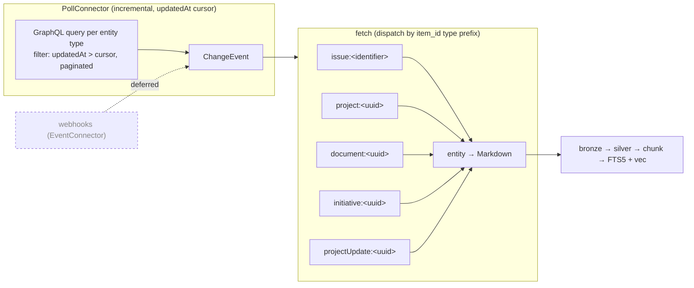

# Linear connector — design spec (MVP / Approach A)

> Per-connector design spec for ingesting a Linear workspace's **roadmap + documentation**
> (Initiatives → Projects → Issues, plus standalone Documents and project/status updates) into
> the kairix knowledge store. Capability model from `../ADR.md`; failure patterns from
> `../proactive-failure-modes.md`. Mirrors the `notion.md` shape — Linear is a near-exact analogue
> (single GraphQL API, content renders to Markdown, incremental poll by `updatedAt`).
>
> **Scope of this spec = Approach A (incremental poll, API-key auth).** Webhooks, OAuth, guided
> config, and per-team scoping are explicitly deferred (see §13 Decision record + §14 Phasing).

## 0. Greenfield → target

**No current implementation.** Not in `kairix/connectors/`, not registered. Sanctioned API surface
(**F37**): Linear's official **GraphQL API** over plain HTTPS — no third-party SDK dependency, so
`DEPENDENCIES.md` stays empty and the connector uses the existing HTTP client library. No
cross-connector / extractor imports (F34/F35).



---

## 1. Identity, capabilities, containers

**`kind`**: `linear`. **Credential boundary**: one workspace = one API key (Linear personal /
workspace key). No single credential spans workspaces. `cc_pair` = (connector, one workspace key,
one workspace). Firm-scope (workspace-wide) for the MVP.

**Container model.** The MVP treats the **workspace as a single container** — `list_changes` polls
all five entity types globally by `updatedAt`. (Per-team containers are a Phase-2 lever; see §14.)

**Hierarchy (conceptual).** `workspace → initiative → project → issue`, with `document` and
`projectUpdate` attached to a project/initiative. The MVP does **not** implement
`HierarchyConnector` — hierarchy is captured as Markdown context + `properties` on each chunk
(parent project/initiative), not as a graph the framework walks. (`HierarchyConnector` is Phase 2.)

**Capability declaration (MVP target).**

| Capability | Implements? | Why |
|---|---|---|
| `SourceConnector` (base) | ✅ | enumerate / fetch / link / sensitivity / metadata / cursor |
| `PollConnector` | ✅ | per-entity GraphQL queries filtered + ordered by `updatedAt` |
| `CredentialsConnector` | ✅ | validate + carry the API key from the kairix secret store |
| `SlimConnector` | ✅ | ids-only enumeration for prune (detect deletes/archives) |
| `CheckpointedConnector` | ⏳ Phase 2 | per-container checkpoint once multi-team containers land |
| `EventConnector` | ⏳ Phase 2 | webhooks — deferred (see §13) |
| `OAuthConnector` | ⏳ Phase 2 | for distributing to other users' workspaces |
| `HierarchyConnector` | ⏳ Phase 2 | initiative → project → issue tree |

`CAPABILITIES` frozenset (F56) for the MVP: `{SourceConnector, PollConnector, CredentialsConnector, SlimConnector}`.

---

## 2. Functions / actions (GraphQL)

Single endpoint, **HTTPS only** (see §3). One `LinearApiClient` wraps GraphQL POSTs with retry +
rate-limit handling; tests inject a `FakeLinearApiClient` (no live network — test discipline).

Per-entity queries follow the same shape (connection + `updatedAt` filter + pagination):

```graphql
query Issues($after: String, $since: DateTimeOrDuration!) {
  issues(first: 100, after: $after, filter: { updatedAt: { gt: $since } }, orderBy: updatedAt) {
    pageInfo { hasNextPage endCursor }
    nodes {
      id identifier title description url createdAt updatedAt
      state { name type } assignee { displayName email }
      team { key name } project { id name } labels { nodes { name } }
    }
  }
}
```

Analogous queries: `projects`, `documents`, `initiatives`, `projectUpdates` — each selecting the
fields §5 renders + §6 needs for provenance. Pagination drains `pageInfo.endCursor` until
`hasNextPage = false`.

---

## 3. Transport security — HTTPS only (invariant)

All Linear API traffic is **TLS / HTTPS, never plaintext**. This is enforced, not incidental:

- The endpoint is a hard-coded constant `https://api.linear.app/graphql` in `api_client.py`.
- `LinearApiClient` **rejects any non-`https` scheme**: if a base-URL override is ever supplied
  (e.g. a test recording proxy), the client asserts `urlsplit(url).scheme == "https"` and raises a
  typed error otherwise — there is no code path that issues an `http://` request.
- A unit test pins this: constructing/calling the client against an `http://` URL raises; the
  default endpoint is `https://`. (No live network in the test — the guard is checked before any
  request is built.)

Rationale: roadmap/doc content is company-internal; the API key is a bearer credential. Plaintext
transport would leak both. (A repo-wide "connectors call `https://` only" fitness rule is a
reasonable later generalisation — noted, not built here.)

---

## 4. Sync model / cursor

`list_changes(cursor: Cursor | None) -> Iterator[ChangeEvent]`:

- **Cursor** = an opaque `str` token (`Cursor = str`; §1 protocols) that **JSON-encodes a
  per-entity-type `updatedAt` watermark map** — `{ "issue": "<iso>", "project": "<iso>",
  "document": "<iso>", "initiative": "<iso>", "projectUpdate": "<iso>" }`. A single shared
  high-water-mark would **starve / skip** types under per-tick-budget pressure: with one watermark,
  a tick that fills the budget on issues advances the shared mark past un-drained project/doc items
  in the window, permanently skipping them (and can livelock issues vs. the rest). Per-type
  watermarks make each type's progress independent.
- Each tick queries the five types for `updatedAt > <that type's watermark>`, paginated, yielding
  `ChangeEvent(op, item_id, modified_at, parent_id?, metadata)`. `op` is `modified` for
  create/update; `SlimConnector` enumeration detects `archived`/`deleted` (id present last tick,
  absent now).
- **`item_id` is type-prefixed** — `issue:<identifier>`, `project:<uuid>`, `document:<uuid>`,
  `initiative:<uuid>`, `projectUpdate:<uuid>` — so `fetch` / `metadata_for` / `source_link`
  dispatch by type without a second lookup.
- `cursor is None` → full enumeration (initial sync). A **malformed / legacy single-string** token
  decodes to "no watermark for any type" → full enumeration, so existing operator state degrades
  safely (re-syncs) rather than skipping data.
- `next_cursor()` returns the JSON-encoded updated map. **Each type advances its OWN watermark to
  the max `updatedAt` it EMITTED this tick** (forward progress even on a budget-limited partial
  drain — *not* "advance only on a fully-clean drain", which livelocks). At-least-once delivery +
  idempotent chunk upsert makes re-fetching a boundary item harmless.
- Honours ONE shared `per_tick_max_items` (default 500) and `disk_watermark_min_free_bytes` (F66)
  across the types this tick — a budget-hit on an earlier type just gives later types fewer/none
  this tick, but no type's watermark is ever moved past its own unprocessed items, so nothing is
  skipped and every type makes progress across ticks.

---

## 5. Rendering (`fetch` → Markdown)

`fetch(item_id) -> RawArtefact(raw=<markdown bytes>, mime="text/markdown", fetched_at, sensitivity_hint)`.
Dispatch by the `item_id` type prefix; the envelope fetched in `list_changes` is cached so `fetch`
+ `metadata_for` don't re-query. Per-type Markdown:

- **Issue** — `# <identifier> <title>`, then a field block (state, assignee, team, project, labels,
  url) + the description body (already Markdown in Linear).
- **Project** — `# <name>`, status/lead/target-date block, description + the project's content doc
  if present, milestone names.
- **Document** — `# <title>` + content body (Linear Documents are Markdown).
- **Initiative** — `# <name>`, overview/description, the list of member projects.
- **Project / status update** — the update narrative + health (on-track / at-risk / off-track) +
  date, attributed to its project.

Chunking happens downstream in `kairix/core/connectors/silver.py` (F38) — the connector only emits
raw Markdown bytes.

---

## 6. Provenance / metadata (F39 + F65)

- `metadata_for(item_id) -> SourceMetadata(modified_at, created_at, author, author_email, tags, properties)`:
  - `author` / `author_email` from the item's creator (issue/doc/update author; project lead).
  - `tags` from Linear labels.
  - `properties`: `{ state, team, identifier, project, initiative, url, health }` (whichever apply).
- `source_link(item_id)` → the canonical `https://linear.app/<workspace>/...` URL.
- `sensitivity_for(item_id)` → the configured `default_sensitivity` (per-team/project override is
  Phase 2).
- Resulting chunks carry `source_uri` (the Linear URL), `source_modified_at` (`updatedAt`),
  `sensitivity` (F39), and `author` + `chunk_date` (from `updatedAt`/`createdAt`) (F65).

---

## 7. Config / topology / scope

`topology` block (manual for the MVP; guided config is Phase 2):

```yaml
topology:
  connectors:
    - id: linear-prod
      kind: linear
      name: "Linear workspace"
      default_sensitivity: internal        # roadmap/docs are company-internal; override per-deploy
      refresh_freq_seconds: 900            # how often to poll, in seconds (900 = every 15 min)
  credentials:
    - id: linear-cred
      kind: bearer_token                   # credential type (the API key is a bearer token)
      secret_name: connector-linear-api-key   # secret store name (without the kairix- prefix)
      admin_public: true                   # every agent may search this source
  cc_pairs:
    - id: cc-linear
      connector: linear-prod
      credential: linear-cred
      name: "Linear workspace pair"        # required
      access_type: PUBLIC                  # every agent can search the workspace
  collections:
    - name: linear
      sources:
        - cc_pair: cc-linear
          path_filter: "*"                 # everything the connector returns
```

One `linear` collection (operator tiers it via `source_tier_boost` — roadmap/docs are
authoritative-ish but not canon; `vault_active` ×1.0 is a sensible default). Firm-scope. The
credential lives in the writable secret store, never a system path (least-privilege; see
`feedback`/ADR-017).

---

## 8. Feature flag (cutover)

New `connector_linear` `FeatureFlag` in `kairix/core/features/registry.py`:
`default=False`, `stage="introduce"`, `owner="connector-framework"`,
`related_spec="docs/architecture/connector-scope-topology/connector-design-specs/linear.md"`,
`target_retire_in` = a ~12-month window (matches the slower-adoption connector cohort). F54
both-branch coverage required (OFF = no Linear polling; ON = the cc_pair drains).

---

## 9. Failure modes / resilience (F64 + F66)

- **Rate limit** — Linear's GraphQL limit is complexity-based; on `429` / `Retry-After` the client
  backs off and retries with a bounded budget (F64 test required).
- **Per-item isolation** — one malformed issue/doc fails just that item (logged WARNING, conversion
  wrapped in `try/except`), never the tick.
- **Cursor safety** — each type's `updatedAt` watermark advances to the max it EMITTED (§4 forward
  progress), never past an un-emitted item; a mid-tick crash re-fetches from the last persisted
  per-type watermark (idempotent upsert). No type is starved or skipped under budget pressure.
- **Budget** — one shared `per_tick_max_items` + disk watermark stop the tick early and resume (F66).

---

## 10. Retrieval-quality contract

Seed ≥1 eval-suite question (F75-aligned) exercising the connector — e.g. "what is our roadmap for
&lt;capability&gt;?" should surface the matching Linear project/initiative; "what does the
&lt;X&gt; design doc say?" should surface the Linear Document. Fixtures use synthetic
Linear-shaped data (no real workspace content in committed tests — F32).

---

## 11. Test plan / F-rule deltas

Shipped in the same commit(s) as the connector:

- **F36** — `tests/bdd/features/connector_linear.feature` (happy-path) + Examples-table row in the
  connectors E2E feature + steps.
- **F54** — `feature_flag_connector_linear.feature` (OFF + ON) + both-branch integration test.
- **F64** — 429/`Retry-After` backoff-retry test on `LinearApiClient`.
- **F65** — `metadata_for` propagation test (author + `chunk_date` land on the chunk).
- **F43** — contract test parametrized over the real `LinearConnector` + a `FakeLinearConnector`.
- **F68** — per-`SourceConnector`-method failure-injection contract test.
- **F56 / F41** — `CAPABILITIES` frozenset; `py.typed`; mypy-strict clean.
- **§3** — HTTPS-only guard test.
- Per-entity-type render unit tests; E2E composed path (`config → factory → connector tick →
  search finds a Linear item`).
- All network behind `FakeLinearApiClient` — no live calls in tests.

---

## 12. Implementation sequence (lowest-novelty-risk first)

1. `api_client.py` — `LinearApiClient` (GraphQL POST, HTTPS-only guard, pagination, 429 backoff) +
   `FakeLinearApiClient`.
2. `connector.py` — `LinearConnector` (`list_changes` cursor, `fetch` dispatch, `metadata_for`,
   `source_link`, `sensitivity_for`, `next_cursor`) + `make_connector` factory + `__init__.py`
   (`version`, `CAPABILITIES`) + `py.typed`.
3. Per-entity Markdown rendering.
4. Config/topology wiring + `connector_linear` feature flag.
5. Full test set (contract / BDD / feature-flag / integration / E2E) + the eval question.
6. `README.md` + `DEPENDENCIES.md`; this spec referenced as `related_spec`.

---

## 13. Decision record — incremental poll, not webhooks (Approach A over B)

**Decision:** the MVP detects changes by **incremental polling** (`PollConnector`, `updatedAt`
cursor), **not** webhooks (`EventConnector`).

**Context:** webhooks give near-real-time freshness (~seconds) vs polling's freshness-bounded-by-cadence
(~poll interval; ≤15 min at the proposed 900 s cadence).

**Why poll for the MVP:**
1. **The content doesn't need it.** Roadmap + docs change on a human cadence; an agent answering
   "what's our roadmap / what does this doc say" is not sensitive to a sub-15-minute edit lag.
2. **Webhooks require a public HTTPS callback** Linear can reach — exactly the inbound-exposure
   friction that conflicts with hardened / closed deployments (the least-privilege posture F94 /
   ADR-017 just hardened). Polling needs only outbound HTTPS.
3. **Lower novelty risk** — mirrors the proven Notion poll connector; no subscription lifecycle,
   HMAC verification, or renewal to get right.

**Consequence:** freshness is the poll cadence (operator-tunable via
`refresh_freq_override_seconds`). Webhooks remain a clean Phase-2 capability for anyone who needs
sub-minute freshness AND can expose a callback.

> This decision is also echoed as a docstring on `LinearConnector` / `make_connector`, pointing back
> to this section.

---

## 14. Phasing / out of scope (MVP)

**Deferred to later waves:** webhooks (`EventConnector`); OAuth (`OAuthConnector`) for other users'
workspaces; guided config (`kairix linear discover / configure / status`, KFEAT-022); per-team
containers + `CheckpointedConnector` + `HierarchyConnector`; per-team/project sensitivity overrides;
comments, cycles, milestones, labels-as-entities. Each is additive and does not change the MVP's
data model.
