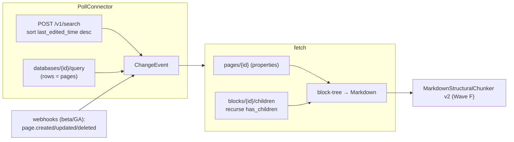

# Notion connector — design spec (Wave E)

> Per-connector design spec across the five operating dimensions. Source-side facts from
> `../01-source-analysis.md §Notion`; capability model from `../ADR.md`; performance from
> `../05-non-functionals.md`. **§5 references `proactive-failure-modes.md`** (Patterns 1–4)
> rather than restating them. Notion is the connector that seeds the Wave F
> `MarkdownStructuralChunker v2` (`../08`, `../ADR.md §Chunker registry`).

## 0. Greenfield → target

**No current implementation.** Not in `kairix/connectors/`, not registered. Sanctioned
change-detection lib (**F37**): `notion_client` (official SDK). No cross-connector / extractor
imports (F35).



---

## 1. Identity, capabilities, containers

**`kind`**: `notion`. **Credential boundary**: one workspace = one token — internal integration
token (`secret_…`) or public OAuth bot token (`../01 §Notion`). No single credential spans
workspaces. `cc_pair` = (connector, one workspace token, one workspace).

**Container model.** An integration sees only pages explicitly shared with it (Connections menu)
or inheriting from a shared ancestor — **access is page-subtree-by-subtree, not workspace-wide**
(`../01`). A **Container = one teamspace** (or one top-level shared root). Cursor = per-container
`last_edited_time` high-water-mark. `iter_containers` derives from the visible top-level set via
`POST /v1/search`.

**Hierarchy.** `workspace → teamspace → page / database → block` (`../01`; databases are a page
type, rows are pages). `load_hierarchy` emits teamspace / page / database `HierarchyNode`s.
**F58**: parent-before-child — note Notion `id`s are stable across moves (`parent` changes,
`id` doesn't), so the hierarchy keys on `id`, never path.

**AccessType** (`../ADR.md`). Notion has **no first-class ACL** (`../01`) — the integration's
*visible set* is the permission. So `SlimConnectorWithPermSync` is **weak**: it reports "still
reachable / now `object_not_found`", not a principal list. Default `AccessType.PRIVATE` with
operator-declared sensitivity; `SYNC` is best-effort visibility mirroring only.

**Capability declaration (target).**

| Capability | Implements? | Why |
|---|---|---|
| `SourceConnector` (base) | ✅ | enumerate teamspaces / fetch page+blocks / link / sensitivity |
| `PollConnector` | ✅ | `search` + `databases/{id}/query` sorted by `last_edited_time` |
| `CheckpointedConnector` | ✅ | `last_edited_time` high-water-mark per container |
| `EventConnector` | ✅ (beta/GA caveat) | webhooks `page.*` / `database.updated` — treat as realtime, poll as reconcile |
| `SlimConnector` | ✅ | `search` ids-only enumeration for prune |
| `SlimConnectorWithPermSync` | ⚠️ weak | visibility-only (no principal ACL) |
| `Resolver` | ✅ | replay failed page/block fetches |
| `HierarchyConnector` | ✅ | teamspace → page → database |
| `OAuthConnector` | ✅ | public OAuth integration flow |

---

## 2. Functions / actions

F42 returns. Chunk writes carry F39 + `chunker_version` (**F55**; Notion markdown →
`MarkdownStructuralChunker v2`, `../08`).

| Action | Signature | Notion API | Notes |
|---|---|---|---|
| Enumerate containers | `iter_containers()` | `POST /v1/search` (visible roots) | one Container/teamspace-or-root |
| Hierarchy | `load_hierarchy(cc_pair)` | `search` + `blocks/{id}/children` | teamspace→page→db; key on stable `id` |
| Poll changes | `list_changes(container)` | `POST /v1/search` + `databases/{id}/query` sort `last_edited_time` | high-water-mark cursor |
| Fetch page | `fetch(item_id) -> RawArtefact` | `GET /v1/pages/{id}` (properties) + `GET /v1/blocks/{id}/children` recursive | block-tree → Markdown |
| Source link | `source_link(item_id)` | page `url` | |
| Sensitivity | `sensitivity_for(item_id)` | operator map | `teamspace:Legal→confidential`, `public_url != null → public` (`../01`) |
| Slim | `retrieve_all_slim_docs(…)` | `search` ids | prune |
| Slim + perms | `retrieve_all_slim_docs_with_perms(…)` | reachability probe | visibility-only |
| Failure replay | `reindex(failures, …)` | per-page/block re-fetch | `Resolver` |
| Subscribe | `subscribe(callback_url)` | Webhooks API (beta/GA) | poll fallback mandatory |
| Handle event | `handle_event(event)` | `page.created/updated/deleted`, `database.updated` | |

**`ChangeEvent.op` mapping**: page created → `CREATED`; updated → `MODIFIED`; `archived: true`
→ `ARCHIVED` (recoverable, still returned with the archived filter); **hard delete** (404, not
in search) → `DELETED` via reconcile-sweep diff (no event); integration connection removed
(`object_not_found`) → `ACCESS_LOST` (distinct from delete, `../01`).

---

## 3. Observability

**Counters**: `pages_fetched`, `db_rows_fetched`, `blocks_walked`, `search_pages`,
`rate_429_total` (3 req/s smoothed), `hard_deletes_detected` (reconcile sweep),
`block_tree_depth_truncations`.

**Gauges**: `freshness_age_seconds{container}`, `rate_limit_budget_remaining_pct` (3 req/s
ceiling — the binding constraint), `block_tree_depth_max`, `webhook_subscription_state`,
`pending_block_walk_queue_depth`.

**Lifecycle events**: `page_access_lost{page_id}` (`object_not_found`), `page_archived`,
`hard_delete_detected{page_id}`, `block_depth_cap_hit{page_id}`, `webhook_beta_unavailable`
(falls back to poll), `backfill_started` / `_completed`.

**Structured-log field set**: `cc_pair_id`, `container_id` (=teamspace/root id), `page_id`,
`notion_request_id`, `http_status`, `retry_after`, `last_edited_time`.

**Surfaces**: `ResultEnvelope` freshness per container; `tool_worker_status` rollup;
`connector status` (§4). The 3 req/s budget is the dominant performance constraint, so
`rate_limit_budget_remaining_pct` is the headline gauge.

---

## 4. Agent affordance

MCP + CLI parity (F53); F30 + F45 per surface. Same tool/verb shape as the other connectors:

| Agent need | MCP tool | CLI verb |
|---|---|---|
| Is Notion current? | `tool_connector_status("notion")` | `kairix connector status notion` |
| Why did this page fail? | `tool_connector_deadletters("notion")` | `kairix connector deadletters notion` |
| Capability set | `tool_connector_capabilities("notion")` | `kairix connector capabilities notion` |
| Force re-sync | `tool_connector_resync("notion", container?)` | `kairix connector resync notion [--space ID]` |
| Replay failures | `tool_connector_reindex("notion")` | `kairix connector reindex notion` |
| Reconcile hard-deletes | `tool_connector_reconcile("notion", container)` | `kairix connector reconcile notion --space ID` |

`tool_connector_status` returns per-container freshness + `webhook_subscription_state` so an
agent can tell "this page-tree hasn't synced since the webhook went to beta-unavailable" and
escalate. Page-access-lost surfaces as an `excluded_collections` hint, not a silent drop.

---

## 5. Failure modes & proactive resolution

Notion **inherits Patterns 1–4 from `proactive-failure-modes.md`** (webhook lifecycle,
rate-limit token-bucket, credential rotation, `ContainerAccessDenied`). Source-specific
instantiations + additions only:

| Failure | Detection | **Proactive behaviour** | Template ref |
|---|---|---|---|
| 3 req/s smoothed limit | `429` + `Retry-After` | single token bucket per integration; bursts allowed, sustained excess backs off | Pattern 2 (single-ceiling) |
| Permission revocation | `object_not_found` on a page that previously existed | **distinguish from delete** → `ACCESS_LOST`, not `DELETED`; `ContainerAccessDenied` if a whole shared root drops | Pattern 4 |
| Webhook beta-unavailable | webhook subscribe 4xx / GA not rolled out | **degrade to poll-only** (mandatory fallback); `webhook_beta_unavailable` event | Pattern 1 |
| Hard delete (no event) | page 404s + absent from `search` | **reconcile-sweep diff** — periodic full `search` vs known-set → tombstone missing ids | **Notion-specific** (not in template) |
| Block-tree depth blow-up | synced blocks + column layouts recurse deeply | **cap recursion depth** to bound rate-limit consumption; `block_depth_cap_hit` event | **Notion-specific** |
| Rich-text fidelity loss | n/a (lossy by design) | accept Markdown drop of colour/underline (retrieval-acceptable, `../01`) | n/a |

The two Notion-specific rows (reconcile-sweep for hard deletes, depth cap) are the only ones
that don't map to a template pattern — everything else is a reference.

---

## 6. Performance

Linked to `../05-non-functionals.md` (Notion row):

- **Storage** (`../05 §Storage`): page ~43 KB; database row ~7 KB. 5k pages + 20k rows ≈
  **350 MB**. **Databases skew dense** — plan ingest cost on *row count*, not page count
  (`../01`).
- **Rate** (`../05 §Rate-limit`): ~3 req/s per integration — **the binding constraint**.
  **Concurrency cap default = 1** (single shared ceiling). Re-scanning 10k pages via search +
  per-page block-fetches takes minutes of API time.
- **Backfill** (`../05 §Initial-backfill`): 10k ≈ 1.5 h, 100k ≈ 14 h — 3 req/s dominates.
- **Conversion**: block-tree → Markdown ~10 ms + API round-trips (`../05`).

---

## 7. Capability declaration (target code shape)

```python
class NotionConnector(                           # kairix/connectors/notion/connector.py
    SourceConnector, PollConnector, CheckpointedConnector,
    EventConnector, SlimConnector, SlimConnectorWithPermSync,
    Resolver, HierarchyConnector, OAuthConnector,
):
    kind = "notion"
    # SlimConnectorWithPermSync is weak (visibility, not principal ACL).
    # Notion seeds MarkdownStructuralChunker v2 (Wave F) for block-tree → Markdown.
```

`notion_client` confined to this plugin per F37.

---

## 8. F-rule & test obligations

- **F37** — `notion_client` only under `kairix/connectors/notion/`.
- **F39** — chunk writes carry sensitivity (operator-declared teamspace/public_url map).
- **F42** — frozen-dc returns.
- **F55** — Notion markdown → `MarkdownStructuralChunker v2` (`../08`, `../ADR.md`); this
  connector is the chunker's seed use-case, so its landing pairs with the Wave F chunker work.
- **F56** — capability declaration + inventory contract test (incl. the weak-perm-sync note).
- **F58** — `load_hierarchy` parent-before-child, keyed on stable `id`.
- **F45 / F36 / F43** — new MCP tools + CLI verbs + `connector_notion.feature` +
  `e2e_connector_sync.feature` row + `tests/contracts/test_notion_protocol.py` (fake + real via
  `notion_client` mock transport).
- **F54** — webhook-vs-poll, multi-container each behind a flag with both-branch tests.

---

## 9. Open decisions

1. **Webhook GA timing** — Notion Webhooks were beta/GA-rolling 2024–2025 (`../01`); gate the
   `EventConnector` path on availability, poll until then. Confirm current GA status at build
   time.
2. **Databases as collections** — each row is a page; database schema → metadata template.
   Ingest dense row-pages as a page-collection (`../01`) — confirm chunking granularity (one
   chunk per row vs per database).
3. **Teamspace → sensitivity map** — operator-declared; where does the map live (connector
   config vs a `credentials` row)?
4. **Synced blocks / column layouts** — depth-cap value; do synced-block references dedup or
   duplicate content across pages?
5. **Container granularity** — teamspace vs top-level-shared-page as the Container unit when the
   integration is shared at page level, not teamspace level.
