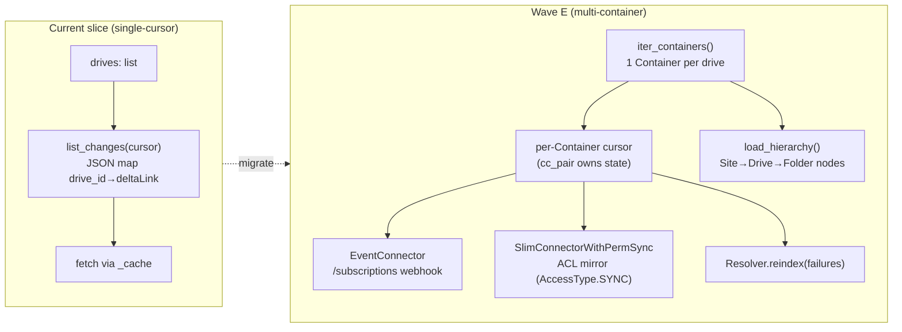

# SharePoint connector — design spec (Wave E)

> Per-connector design spec across the five operating dimensions: **functions/actions,
> observability, agent affordance, failure modes / proactive resolution, performance.**
> Grounded against the *current* code (`kairix/connectors/sharepoint/connector.py`,
> `graph_client.py`) and the ADR v2 capability model
> (`../ADR.md`). This is the implementation contract for bringing SharePoint from its
> current single-cursor slice to the Wave E multi-container bar. Source-side facts are
> referenced from `../01-source-analysis.md §SharePoint`; performance envelopes from
> `../05-non-functionals.md`. Numbers are *linked, not restated*, so they don't drift.

## 0. Current state → target (read this first)

Today (`connector.py`) SharePoint is a **single-cursor `SourceConnector`** driving a flat
`list[SharePointDriveSpec]`:

- Implements the base surface — `list_changes(cursor)`, `fetch(item_id)`, `source_link`,
  `sensitivity_for` (`connector.py:217-291`).
- Carries Wave B capability **shims** — `load_from_checkpoint` (→ forwards to `list_changes`),
  `load_credentials` (identity), `oauth_*` (raise actionable `NotImplementedError` — app-only,
  no three-legged flow) (`connector.py:303-352`).
- Cursor is a JSON map `drive_id → deltaLink`, serialised to one opaque string
  (`_serialise_cursor`/`_deserialise_cursor`, `connector.py:401-421`).
- A per-tick `_cache: dict[str, DriveItemRef]` lets `fetch` resolve drive/url/mime without a
  second Graph call (`connector.py:206`, `245-265`).
- Sensitivity is a flat `default_sensitivity` (`internal`); **no Purview routing**
  (`connector.py:283-291`).

The connector's own docstring (`connector.py:23-31`) names what this spec must deliver:
**per-drive `iter_containers` / `load_hierarchy`, Purview-label sensitivity, SharePoint list
items.** The five sections below are the contract for that work.



---

## 1. Identity, capabilities, containers

**`kind`**: `sharepoint`. **Credential boundary**: one Azure AD app registration = one tenant
(shared with the M365 mail/calendar siblings per ADR-019 — `connector-m365-*` secret triple,
`connector.py:122-137`). One `cc_pair` = (this connector, one credential, one tenant).

**Container model.** A **Container = one Graph drive** (document library or OneDrive). This is
the cursor-scope unit (Break point #1, `../ADR.md`). The current flat `drives` list becomes the
output of `iter_containers()`; each Container carries its own delta token in
`connector_containers` rather than the single packed JSON string.

**Hierarchy.** `Tenant → Site → Drive → Folder → DriveItem` (`../01 §SharePoint`).
`load_hierarchy()` emits `HierarchyNode`s for Site / Drive / Folder so "files-in-folder" and
"siblings-of-doc" queries don't re-parse `source_uri` (Break point #16). **F58** applies:
every node's `raw_parent_id` is `None` (root) or a previously-emitted node within the same call.

**AccessType** (`../ADR.md §AccessType`). SharePoint is the canonical `AccessType.SYNC` case —
the source owns who-sees-what. The per-drive ACL (`GET /drives/{id}/items/{id}/permissions`,
`../01 §SharePoint`) is mirrored via `SlimConnectorWithPermSync`. Operator may pin
`PUBLIC`/`PRIVATE` per cc_pair when ACL mirroring is not wanted (e.g. a `Sites.Selected`
allowlist that's already trust-bounded).

**Capability declaration (target).** F56 requires base + ≥1 of
{Poll, Checkpointed, Event}. SharePoint declares:

| Capability | Implements? | Why |
|---|---|---|
| `SourceConnector` (base) | ✅ already | `fetch`/`source_link`/`sensitivity_for` + new `iter_containers` |
| `PollConnector` | ✅ (rename of today's `list_changes`) | delta query per drive is the poll surface |
| `CheckpointedConnector` | ✅ already (shim) | delta `deltaLink` *is* the checkpoint; per-drive |
| `EventConnector` | ✅ **new** | Graph `/subscriptions` webhook on `driveItem` (notification-only — wakes the delta loop, `../01`) |
| `SlimConnector` | ✅ **new** | cheap id-only enumeration for prune cycles |
| `SlimConnectorWithPermSync` | ✅ **new** | per-doc ACL mirror for `AccessType.SYNC` |
| `Resolver` | ✅ **new** | per-doc failure replay (`reindex(failures)`) — cheaper than re-running a delta window |
| `HierarchyConnector` | ✅ **new** | Site/Drive/Folder tree |
| `OAuthConnector` | ❌ N/A | app-only client-creds; shim already raises actionable `NotImplementedError` (`connector.py:325-352`) |

---

## 2. Functions / actions

The complete action surface, current → target, with the Graph call behind each. Return types
obey **F42** (frozen dataclass / tuple thereof). All chunk writes downstream carry
`source_uri`+`source_modified_at`+`sensitivity` (**F39**) and `chunker_version` (**F55**).

| Action | Signature (target) | Graph endpoint | Notes vs current |
|---|---|---|---|
| Enumerate containers | `iter_containers() -> Iterator[Container]` | `GET /sites/{id}/drives`, `/users/{id}/drive` | **new** — replaces flat `drives` list; emits one Container/drive |
| Hierarchy | `load_hierarchy(cc_pair) -> Iterator[HierarchyNode]` | `GET /sites?search=*`, `/drives/{id}/root/children` | **new** — Site→Drive→Folder, F58-ordered |
| Poll changes | `list_changes(container) -> Iterator[ChangeEvent]` | `GET /drives/{id}/root/delta` + `@odata.deltaLink` | current is single packed cursor; target keys per Container |
| Checkpoint resume | `load_from_checkpoint(container, checkpoint)` | same delta endpoint, resume from token | shim exists (`connector.py:303`); make per-container |
| Fetch body | `fetch(item_id) -> RawArtefact` | `GET /drives/{id}/items/{id}/content` (302 → pre-auth URL) | current works (`connector.py:245`); add `sensitivity_hint` to `RawArtefact` |
| Source link | `source_link(item_id) -> str` | `webUrl` from envelope | works (`connector.py:267`) |
| Sensitivity | `sensitivity_for(item_id) -> Sensitivity` | `sensitivityLabel` facet + `POST .../extractSensitivityLabels` | current returns flat default; target reads Purview label → operator `{label_guid: tier}` map |
| Slim enumerate | `retrieve_all_slim_docs(container, start, end)` | `GET /drives/{id}/root/delta` (ids only, `$select=id,lastModifiedDateTime`) | **new** — prune cycle |
| Slim + perms | `retrieve_all_slim_docs_with_perms(...)` | `+ GET .../items/{id}/permissions` | **new** — ACL mirror |
| Failure replay | `reindex(failures, *, include_permissions=False)` | per-item `GET /drives/{id}/items/{id}` | **new** — `Resolver`; replays only `ConnectorFailure.failed_document_id`s |
| Subscribe | `subscribe(callback_url) -> Subscription \| None` | `POST /subscriptions` (resource `/drives/{id}/root`) | **new** — `EventConnector` |
| Renew | `renew_subscription(sub) -> Subscription` | `PATCH /subscriptions/{id}` (new `expirationDateTime`) | **new** — ~3-day lifetime (`../01`) |
| Handle event | `handle_event(event) -> Iterator[ChangeEvent]` | notification body → wakes delta drain | **new** — notification-only; no content in webhook |

**`ChangeEvent.op` mapping** (target enum `CREATED/MODIFIED/ARCHIVED/ACCESS_LOST/DELETED`,
`../ADR.md`): delta `deleted` facet → `DELETED`; `parentReference` change → `MODIFIED`
(move/rename); permission-only delta entry that drops the credential's access → `ACCESS_LOST`;
retention-held visible-but-removed → keep as `MODIFIED` with `metadata.retention_held=True`.
Current code only emits `created`/`deleted` (`connector.py:371-398`) — extend.

---

## 3. Observability

**Today there is none** beyond the dead-letter count and `tool_worker_status`. This is the
biggest gap. SharePoint emits the standard connector telemetry set, instantiated for its
specific signals:

**Counters** (per cc_pair, per container/drive):
- `items_seen`, `items_written`, `items_dead_lettered`, `items_pruned`
- `delta_pages_fetched`, `delta_resync_required_total` (server invalidated the token)
- `throttle_429_total`, `throttle_503_total`, `retry_after_seconds_sum`
- `perm_sync_docs`, `acl_changes_applied`

**Gauges**:
- `freshness_age_seconds{drive}` — feeds the `ResultEnvelope` freshness block (`../05
  §Freshness envelope`)
- `delta_token_age_seconds{drive}`, `subscription_expires_in_seconds{drive}`
- `throttle_budget_remaining_pct` — derived from the 10k/10min envelope (`../05 §Rate-limit`)
- `pending_extract_queue_depth` (ExtractorPool, `../05 §backpressure`)

**Lifecycle events** (structured log + emitted to a `connector_events` surface):
`subscription_established` / `_renewed` / `_expired` / `_revoked`,
`backfill_started` / `_completed{item_count, duration}`,
`container_access_denied{drive_id}` (Sites.Selected revoked),
`delta_resync_required{drive_id}` (token invalidated), `credential_rotated`.

**Structured-log field set** (every connector log line): `cc_pair_id`, `container_id`
(=drive_id), `op`, `item_id`, `graph_request_id` (Graph's `request-id` header — the single most
useful field for a Microsoft support ticket), `http_status`, `retry_after`.

**Where it surfaces**:
1. Extend the `ResultEnvelope` freshness block (already designed, `../05`) — per-drive
   `last_synced_at` / `age_seconds` / `state ∈ {fresh,stale,access-revoked,not-yet-synced}`.
2. Extend `tool_worker_status` (`kairix/agents/mcp/server.py:684`) with a per-cc_pair
   connector-health rollup.
3. New read surface `connector status` (see §4) returns the full counter/gauge/event snapshot.

**Proposed F-rule (docs-only here):** *"every connector emits the standard telemetry event set
(`subscription_*`, `backfill_*`, `*_access_denied`, `delta_resync_required`)."* Not built in
this spec.

---

## 4. Agent affordance

What an agent can **read** and **trigger** about SharePoint, mapped to a concrete MCP + CLI
surface (parity is mandatory — `cli-mcp-feature-parity.md`, F53 precedent). New tools each need
an F30 outcome test + F45 `.feature` file in the landing commit.

**Status reads** (no side effects):

| Agent need | MCP tool | CLI verb | Envelope (frozen dc / dict) |
|---|---|---|---|
| Is SharePoint current? | `tool_connector_status("sharepoint")` | `kairix connector status sharepoint` | `{cc_pair, containers:[{drive_id, state, age_seconds, last_synced_at}], dead_letter_count}` |
| Why did this item fail? | `tool_connector_deadletters("sharepoint")` | `kairix connector deadletters sharepoint` | `[{item_id, failure_kind, failure_message, failure_count, last_attempt}]` (mirrors `ConnectorFailure`) |
| What can this connector do? | `tool_connector_capabilities("sharepoint")` | `kairix connector capabilities sharepoint` | `{capabilities:[...], access_type, container_count}` |
| Subscription health | (rolled into `tool_connector_status`) | — | `subscription_expires_in_seconds` per drive |

**Triggerable actions** (side effects → confirm/authorise like any write):

| Agent need | MCP tool | CLI verb | Effect |
|---|---|---|---|
| Force a re-sync | `tool_connector_resync("sharepoint", drive_id?)` | `kairix connector resync sharepoint [--drive ID]` | clears delta token → full re-drain (operator-gated; rate-limit aware) |
| Replay failures | `tool_connector_reindex("sharepoint")` | `kairix connector reindex sharepoint` | calls `Resolver.reindex(failures)` — replays only dead-lettered ids |
| Rotate credential | (operator-only) | `kairix cc-pair rotate-credential <id>` | **reuses existing `cc-pair` CLI** (`kairix/core/connectors/cc_pair_cli.py`) |
| Request site grant | surfaced as `escalation_hint` in `ResultEnvelope.excluded_collections` | — | `Sites.Selected` revoked → agent tells operator to re-POST the grant |

Anchor: the freshness envelope is *explicitly designed for agent decisions* (`../05`: "the
Notion data is 3.5 hours old, that exceeds the freshness budget — request operator action").
SharePoint instantiates that — an agent preparing a SoW sees `state: "access-revoked"` on the
client-x drive and escalates rather than silently returning stale results.

---

## 5. Failure modes & proactive resolution

The reactive baseline exists (dead-letter + `Retry-After`); the **proactive layer is new**.
Each row: detection → reactive baseline → proactive behaviour → escalation. Timing budgets
referenced from `../05 §Failure-mode timing budgets`.

| Failure | Detection signal | Reactive baseline (today) | **Proactive behaviour (new)** | Escalation |
|---|---|---|---|---|
| Subscription expiry (~3d) | `expirationDateTime` approaching | — (would silently stop) | **renewer pre-empts at 50% TTL** via `renew_subscription`; falls back to poll if renew 4xx | none if renewed; event if renew fails |
| Subscription revoked | webhook stops + delta lacks notifications | — | poll detects gap → re-`subscribe`; if 403, drop to poll-only | `container_access_denied` event |
| Delta token invalidated | Graph `410 / resync required` | — (crash) | catch → restart `/delta` **without token** (full re-drain for that drive only) | `delta_resync_required` event + counter |
| Throttling (429/503) | `Retry-After` header | per-item dead-letter (wrong!) | raise `ContainerTransient(retry_after)` → **token-bucket backoff per drive**, shared across worker threads (`../05 §Burst`) | none (transparent) |
| `Sites.Selected` revoked | `403` on a drive | generic error | raise `ContainerAccessDenied` → **cc_pair stays alive for other drives**; mark drive `access_state=revoked` | `excluded_collections` w/ grant `escalation_hint` |
| Credential (secret) expired | `401` / `CredentialExpiredError` | crash | **rotate under per-cc_pair lock** (Onyx `OnyxDBCredentialsProvider` pattern, Break #13); pause cc_pair if no fresh secret | operator alert |
| Per-item fetch/extract failure | exception mid-stream | dead-letter after threshold (3) | emit `ConnectorFailure(failed_document_id, kind)` → `Resolver.reindex` replays just those | dead-letter count visible (§4) |
| Large-file 302 URL expired | download 403 mid-stream | retry whole item | **stream, don't buffer**; re-request the 302 (URL TTL is minutes, `../01`) | dead-letter if persistent |
| `package` items (OneNote/Loop) | `package` facet | crash on download | **skip with typed `ContainerTransient`-free SKIP** + structured-log `unsupported_package` | none (known gap) |

**Subscription-renewal state machine** (the proactive core):

```
   subscribe ──→ ACTIVE ──(T-50%)──→ renew ──ok──→ ACTIVE
                   │                    │
                   │                  4xx│
                   ▼                     ▼
              (webhook gap)         POLL_ONLY ──(next cycle)──→ re-subscribe
                   │                                                  │
                 403│                                              ok  ▼
                   ▼                                               ACTIVE
              POLL_ONLY (revoked) ──→ container_access_denied event
```

This composes with the **cc_pair lifecycle state machine** (F57:
`SCHEDULED → INITIAL_INDEXING → ACTIVE ↔ PAUSED/DELETING/INVALID`). A `CredentialExpiredError`
with no fresh secret transitions the cc_pair to `INVALID`; a successful rotation returns it to
`ACTIVE`. All transitions go through the `_ALLOWED_TRANSITIONS` dispatch dict F57 mandates.

---

## 6. Performance

All numbers link to `../05-non-functionals.md` (do not restate — surfaced here for the
SharePoint row only):

- **Storage** (`../05 §Storage`): docx ~58 KB/item, xlsx ~180 KB, pptx ~216 KB, pdf ~130 KB.
  50k mixed-doc tenant ≈ **5.5 GB** SQLite+vectors. Bronze adds raw-size sum; default 30-day
  retention + prune.
- **Rate limit** (`../05 §Rate-limit`): ~10k req / 10 min / app / tenant (operator-observed,
  not contractual). **Concurrency cap default = 4 drives** (4 drives × 5-min poll ≈ 1200 req —
  comfortable). Honour `Retry-After`; token-bucket per container.
- **Backfill** (`../05 §Initial-backfill`): 10k items ≈ 45 min; 100k ≈ 6 h (throttled). Initial
  enumeration of a huge tenant **must be per-drive with backoff, not fan-out** (`../01` gotcha).
  `kairix backfill` mode temporarily raises the cap.
- **Conversion backpressure** (`../05 §Conversion cost`): pptx 200–800 ms, pdf 100 ms–5 s,
  pdf+OCR 2–30 s/page can pin a worker. Extraction runs in a **separate ExtractorPool** from
  the list-changes loop (`Connector → list_changes queue → ExtractorPool → EmbedPool →
  ChunkRouter`). `pending_extract_queue_depth` gauge (§3) is the backpressure signal.
- **Topology overhead** (`../05 §Topology overhead`): CollectionRouter ~5 µs/item; per-drive
  container rows +~100 B each — O(MB) for large tenants. Negligible vs the conversion cost.

---

## 6.5 Retrieval-quality contract (per-connector eval surface)

Wave E ships the *plumbing* — `iter_containers` / `load_hierarchy` / per-drive cursors — but retrieval quality post-Wave-E is what the operator actually feels. KFEAT-019's behaviour-matrix covers the *test-surface* mechanically; this section reserves the *per-connector gold-suite* that catches IM-6-class regressions specifically on SharePoint.

**Gold-suite shape** (lives at `kairix/quality/benchmark/suites/sharepoint-gold-v1.yaml`):

| Query class | Example | Expected behaviour |
|---|---|---|
| PDF body content | `"engagement scope phase 2 budget"` | Top-3 results include the PDF chunk carrying that phrase; snippet shows the matching paragraph |
| DOCX heading-anchored | `"section 4.2 risk register"` | Top result is the DOCX chunk under heading "Section 4.2 — Risk Register" (heading-aware chunking lift) |
| PPTX slide title | `"target operating model slide"` | Slide title outranks slide body for title queries (Wave F SlideChunker prerequisite — caught here pre-Wave-F as a regression baseline) |
| XLSX row content | `"client BOQ data strategy 2021"` | Top result is the matching row chunk, not the whole sheet (Wave F TabularRowChunker prerequisite) |
| Cross-format retrieval | `"GTM intelligence platform"` | Multiple formats represented in top-10 (PDF + PPTX + DOCX); no single-format domination |
| Negative — wrong tenant | `"<query containing other-tenant phrase>"` | Zero results from this tenant's drives (tenancy isolation contract) |
| Negative — access-revoked | `"<query for content on a revoked drive>"` | Returns `excluded_collections` envelope rather than stale results (proactive failure surfaces) |
| Cross-collection BM25 | `"engagement scope"` (asked while reference-library also has chunks) | SharePoint chunks rank by relevance, not by collection-IDF dilution (KFEAT-015 dependency surfaces here) |

**Threshold**: weighted score ≥ 0.85 on every alpha cut that touches SharePoint code. Drift > ±2pp from the previous alpha fires a regression alert, mirrors the reflib pattern documented in ADR-021.

**Fixture corpus**: see §6.7 below. The gold suite references `tests/fixtures/sharepoint/` so the suite is hermetic (no real-tenant dependency in CI).

**Why**: the IM-6 reflib drift (KFEAT-015 motivation) happened because a corpus addition wasn't gated on a per-collection eval. Per-connector eval makes "did this Wave E slice degrade SharePoint retrieval?" mechanically answerable without a full reflib run.

---

## 6.6 Implementation sequence

Order matters — each method's complexity composes with what's already landed. Recommended order, lowest-novelty-risk first:

1. **`iter_containers()` + per-drive cursor migration** (the cursor blast-radius fix). Replaces flat `drives` list with one Container per drive; cursor moves from packed JSON to per-Container `cursor_token`. Bit-for-bit OFF-branch behaviour preserved behind `topology_sharepoint` flag. Pre-existing tests must still pass.
2. **`load_hierarchy()` Site→Drive→Folder** (independent of cursor work). Read-only enumeration; F58 parent-before-child contract. Adds a `tests/contracts/test_sharepoint_hierarchy_parent_before_child.py` sibling.
3. **`SlimConnector.retrieve_all_slim_docs(container)`** (cheap id-only enumeration for prune cycles). Independent of (2). Uses the existing delta endpoint with `$select=id,lastModifiedDateTime`.
4. **`SlimConnectorWithPermSync.retrieve_all_slim_docs_with_perms(container)`** (depends on (3)). Adds the per-doc `GET /drives/{id}/items/{id}/permissions` call. Operator opt-in via cc_pair `access_type: SYNC` declaration.
5. **`Resolver.reindex(failures)`** (independent). Per-item replay from `ConnectorFailure.failed_document_id`s — cheaper than re-running a delta window after a partial-fetch failure. Test-driven via deliberate `ContainerTransient` injection.
6. **Purview-label → F39 tier routing** in `sensitivity_for(item_id)` (independent of containers; depends on operator config schema decision §9.1). Reads `sensitivityLabel` facet, looks up `{label_guid: tier}` map.
7. **`EventConnector` subscribe / renew / handle_event** (highest novelty risk, land last). Includes the subscription-renewal state machine from §5. Notification-only webhook wakes the existing delta loop — no content in webhook payload.

Each step lands behind the same `topology_sharepoint` flag with F54 both-branch coverage. Steps (1) through (5) can be parallelised in three subagents if cherry-pick discipline holds; (6) and (7) sequential because they depend on §9.1 and §5 respectively.

**Cutover within each step**: per `docs/architecture/feature-flag-architecture.md` — capture baseline eval on the gold suite from §6.5 → flip flag for that step → 24h soak → diff → promote stage or rollback. Don't bundle steps for the cutover protocol; each one gets its own measured window.

---

## 6.7 Test-fixture corpus contract

What ships under `tests/fixtures/sharepoint/` to make the §6.5 gold suite + the per-format E2Es hermetic (no real-tenant calls in CI):

| Fixture | Purpose | Today | Wave E target |
|---|---|---|---|
| `pdf_engagement.pdf` (1 page, ~30 KB) | PDF body extraction smoke | ✅ shipped at `7158244d` | Keep; add a 5-page PDF for pagination + 1 OCR-only scanned PDF |
| `docx_risk_register.docx` (~40 KB) | DOCX heading-aware extraction | ✅ shipped | Keep; add a DOCX with mixed heading depths for §6.5 row 2 |
| `pptx_target_op_model.pptx` (2 slides, ~80 KB) | PPTX slide extraction | ✅ shipped | Keep; add a 20-slide deck with speaker-notes (Wave F SlideChunker fixture) |
| `xlsx_client_data.xlsx` (3 sheets) | XLSX row extraction | not shipped — add now | Per §6.5 row 4 (Wave F TabularRowChunker fixture) |
| `manifest.yaml` | Maps each fixture to (expected_op, expected_format, expected_sensitivity, expected_min_score) | not shipped — add | Drives both gold-suite assertions and E2E expectations from one source of truth |
| `tenant_a/` + `tenant_b/` subdirs | Tenancy isolation fixtures for §6.5 row 6 | not shipped | Two-tenant separation under one fixture root |

Per-fixture cap: ≤500 KB each, ≤5 MB total corpus. Pre-commit hook `scripts/checks/check_fixture_corpus_size.py` enforces (proposed; not built — F-rule in this spec, builds with the Slack spec's identical concern).

---

## 6.8 Expected F-rule baseline movements

Landing Wave E SharePoint per §6.6 WILL move baselines. Cherry-pick review must expect this delta; movement outside this envelope is a flag for the reviewer.

| Baseline | Expected delta | Why |
|---|---|---|
| `f30-operator-outcome-tests-files.txt` | +5 entries net-new tests, then -5 within same commit | Each new MCP tool (`tool_connector_status` / `_deadletters` / `_capabilities` / `_resync` / `_reindex`) adds an outcome test; F30 baseline tracks files, not tests — net zero |
| `f45-files.txt` | -2 entries | Two new `.feature` files (`feature_flag_topology_sharepoint_*.feature`) land per F54; baseline shrinks by their absence-tolerance |
| `f46-files.txt` | unchanged | New BDD steps use the `build_connector_pipeline` factory per F46; net zero |
| `f47-integration-factory-files.txt` | unchanged | Same — new integration tests use factory composition |
| `f54-files.txt` | -7 entries | Seven new behaviour swaps land each with both-branch coverage (per §6.6 step list) |
| `f55-files.txt` | unchanged | No new `Chunk(...)` constructor sites in this connector slice (Wave F chunker plugins are the F55 surface) |
| `f56-files.txt` | unchanged | Capability declaration stays at 1 file (CAPABILITIES frozenset) |
| `f58-files.txt` | -1 entry | `test_sharepoint_hierarchy_parent_before_child.py` added per step (2) above |
| `unused-params-named-files.txt` | unchanged | New code respects F19 from day one |
| `no-duplicate-string-files.txt` | possible +1 if not careful | Watch for repeated Graph URL fragments (`/drives/`, `/sites/`, etc.) — extract `_GRAPH_DRIVES_PATH` / `_GRAPH_SITES_PATH` constants from the start |

**KFEAT-019 matrix** gains rows for: every new MCP tool × test-layer; every new CLI verb × test-layer; SharePoint → BM25 round-trip × test-layer; SharePoint → vector-search round-trip × test-layer. Reviewer asserts the matrix gains exactly these rows.

---

## 7. Capability declaration (target code shape)

```python
class SharePointConnector(                       # kairix/connectors/sharepoint/connector.py
    SourceConnector, PollConnector, CheckpointedConnector,
    EventConnector, SlimConnector, SlimConnectorWithPermSync,
    Resolver, HierarchyConnector,
):
    kind = "sharepoint"
    # base + poll/checkpoint already real (connector.py:217-313);
    # iter_containers / load_hierarchy / subscribe* / retrieve_all_slim_* /
    # reindex are the net-new Wave E methods enumerated in §2.
```

F56 is satisfied (base + Poll + Checkpointed + Event). OAuthConnector is deliberately *not*
declared — the shim's actionable `NotImplementedError` (`connector.py:325-352`) stays as the
guard against mis-routing into a three-legged flow.

---

## 8. F-rule & test obligations (the discipline this spec inherits)

Landing the Wave E methods is gated by the existing connector F-rules — this spec does **not**
relax any of them:

- **F37** — `msgraph`/`msgraph_core` imports stay under `kairix/connectors/sharepoint/` (the
  `graph_client.py` boundary already holds this).
- **F39** — every chunk write passes `source_uri`+`source_modified_at`+`sensitivity`; the
  Purview-label path feeds `sensitivity` per item via `RawArtefact.sensitivity_hint`.
- **F42** — `Container`, `HierarchyNode`, `Subscription`, `SlimDoc(WithPerms)` returns are
  frozen dataclasses.
- **F55** — downstream `Chunk(...)` carries `chunker_version` (office docs route through the
  SlideChunker / TabularRowChunker per `../08`).
- **F56** — capability declaration above; a capability-inventory contract test asserts the set.
- **F58** — `load_hierarchy` parent-before-child; requires a
  `tests/contracts/test_*hierarchy*parent_before_child*` test referencing `HierarchyConnector`.
- **F45 / F36 / F43** — new MCP tools (`tool_connector_status` etc.) + CLI verbs each need a
  `.feature` + outcome test in the landing commit; the connector needs
  `tests/bdd/features/connector_sharepoint.feature`, an `e2e_connector_sync.feature` Examples
  row, and `tests/contracts/test_sharepoint_protocol.py` running the same assertions against
  the fake and the real client (mock-transport `httpx`).
- **F54** — each behaviour swap (multi-container routing, perm-sync, webhook) lands behind a
  feature flag with both-branch BDD + integration + E2E composed-path tests.

---

## 9. Open decisions (flag before building)

1. **Purview label → F39 tier map** — operator-config `{label_guid: tier}` per tenant; default
   unlabelled → `internal`, `public` only on explicit opt-in (`../01`). Where does the map
   live — connector config or a tenant-level `credentials` row?
2. **Teams channel files** — they're SharePoint DriveItems under the team's site (`../01`).
   Decide: does the SharePoint connector enumerate them (via `/teams/{id}/channels/.../filesFolder`),
   or does a separate `teams` connector own them and reuse this delta surface? (`../01 §Teams`
   leans reuse.)
3. **SharePoint *list* items** (not just document libraries) — deferred in the current slice
   (`connector.py:29`). In or out of Wave E?
4. **Delegated vs app-only default** — `../01` describes three auth shapes; current code is
   app-only client-creds only. Delegated ("ingest what I can see") is a different `OAuthConnector`
   path — defer or add?

## 10. Path filtering (shipped 2026-05-25)

Per-drive `include_paths` and `exclude_paths` scope which folders within a configured drive get indexed. Default-empty preserves whole-drive walks (back-compat).

**Operator config:**
```yaml
connector_specific_config:
  drives:
    - drive_id: "b!a0rph..."
      include_paths: ["/Curated-Content", "/Shared Documents"]
      exclude_paths: ["/Curated-Content/draft"]
```

**Semantics:** segment-boundary prefix match (case-insensitive), exclude wins on overlap, exact-overlap of include + exclude refused at parse time. Items with missing `parentReference.path` are dropped when a filter is active (logged at DEBUG). Startup probe issues one Graph call per include_path and warns on 404s without failing init.

**Implementation:** `kairix/connectors/sharepoint/connector.py` — `path_passes_filter` pure helper + `_item_passes_spec_filter` method + `_probe_include_paths` startup hook. Display name auto-synthesises from first include_path when operator hasn't set one explicitly, so multiple cc_pairs against the same drive are distinguishable in status surfaces.

**Full spec:** [`docs/architecture/sharepoint-path-filtering.md`](../../sharepoint-path-filtering.md) — design, test contract, implementation contract, four open questions with resolution rationale.

**Known v1 limitation:** no per-folder delta optimisation — we walk the full drive delta and post-filter. Sub-optimal on huge drives with small includes (~10× wasted listing on a 100 GB drive with a 1 GB include). Future enhancement: switch to per-folder walks when the include set is small.
