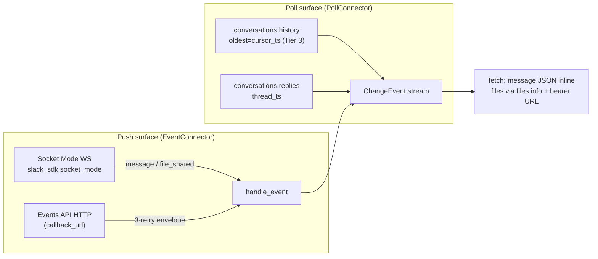

# Slack connector — design spec (Wave E)

> Per-connector design spec across the five operating dimensions: **functions/actions,
> observability, agent affordance, failure modes / proactive resolution, performance.**
> Source-side facts referenced from `../01-source-analysis.md §Slack`; capability model from
> `../ADR.md`; performance envelopes from `../05-non-functionals.md`. Numbers are *linked, not
> restated*. Slack is the **canonical proactive-failure-mode connector** — its §5 is written in
> full and later extracted into `proactive-failure-modes.md` for GitHub / Drive / Notion / Jira
> to reference.

## 0. Greenfield → target (read this first)

**No current implementation.** Slack is not in `kairix/connectors/` and not registered in
`pyproject.toml`. This spec is the build contract for a greenfield connector, designed against
the ADR v2 capability model. Sanctioned change-detection lib (**F37**): `slack_sdk`
(`WebClient` for REST, `slack_sdk.socket_mode` for the push WebSocket). No reach into other
connectors (**F35**); no extractor imports.



---

## 1. Identity, capabilities, containers

**`kind`**: `slack`. **Credential boundary**: one workspace = one credential (or one Enterprise
Grid org via `admin.*` scopes). Three token shapes (`../01 §Slack`): bot `xoxb-…` (default),
user `xoxp-…`, app-level `xapp-…` (Socket Mode connection). `cc_pair` = (connector, one
workspace credential, one workspace/org).

**Container model.** A **Container = one conversation** — public channel, private channel, MPIM
(group DM), or DM. This is the cursor-scope unit: each channel carries its own `latest`
high-water-mark `ts`. The bot only sees channels it's invited to (`../01`), so `iter_containers`
enumerates `conversations.list(types=public_channel,private_channel,mpim,im)` filtered to
membership.

**Hierarchy.** `Workspace → channel → thread → message` (`../01`). `load_hierarchy` emits
`HierarchyNode`s for Workspace / channel / thread (thread keyed on `thread_ts`). **F58**:
parent-before-child within one `load_hierarchy` call (workspace → channel → thread).

**AccessType** (`../ADR.md §AccessType`). `AccessType.SYNC` — channel membership is the source
of truth. `SlimConnectorWithPermSync` mirrors per-channel membership
(`conversations.members`). F39 tier composes on top: public channel → `internal`, private /
MPIM → `client-confidential`, DM → `personal` (`../01 §Slack`).

**Capability declaration (target).** F56 requires base + ≥1 of {Poll, Checkpointed, Event}:

| Capability | Implements? | Why |
|---|---|---|
| `SourceConnector` (base) | ✅ | `iter_containers` / `fetch` / `source_link` / `sensitivity_for` |
| `PollConnector` | ✅ | `conversations.history` with `oldest=<cursor_ts>` (reconcile fallback) |
| `CheckpointedConnector` | ✅ | per-channel `ts` cursor (200-msg pages) |
| `EventConnector` | ✅ | Events API HTTP **and/or** Socket Mode WS — the realtime surface |
| `SlimConnector` | ✅ | id+ts-only enumeration for prune cycles |
| `SlimConnectorWithPermSync` | ✅ | `conversations.members` → per-channel ACL |
| `Resolver` | ✅ | replay failed message/file fetches |
| `HierarchyConnector` | ✅ | Workspace → channel → thread |
| `OAuthConnector` | ✅ | OAuth v2 install flow (three-legged) — **unlike SharePoint** |

---

## 2. Functions / actions

Return types obey **F42** (frozen dc / tuple). Chunk writes carry F39 fields + `chunker_version`
(**F55**; chat routes to the `ThreadAwareChunker`, `../08`).

| Action | Signature (target) | Slack API | Notes |
|---|---|---|---|
| Enumerate containers | `iter_containers() -> Iterator[Container]` | `conversations.list(types=…)` | one Container/channel; filter to bot membership |
| Hierarchy | `load_hierarchy(cc_pair)` | `conversations.list` + `conversations.replies` | Workspace→channel→thread, F58-ordered |
| Poll changes | `list_changes(container)` | `conversations.history(channel, oldest=ts)` | Tier 3 ~50/min; 200 msgs/page cursor |
| Thread expand | (internal) | `conversations.replies(channel, ts)` | keyed on `thread_ts` |
| Checkpoint resume | `load_from_checkpoint(container, ts)` | same `history` from `oldest` | per-channel |
| Fetch body | `fetch(item_id) -> RawArtefact` | message JSON inline; `files.info` + bearer-auth private URL for files | files dominate storage |
| Source link | `source_link(item_id)` | `chat.getPermalink` | stable permalink |
| Sensitivity | `sensitivity_for(item_id)` | channel type | public→internal, private/MPIM→confidential, DM→personal |
| Slim enumerate | `retrieve_all_slim_docs(container, start, end)` | `conversations.history` (`ts` only) | prune cycle |
| Slim + perms | `retrieve_all_slim_docs_with_perms(…)` | `+ conversations.members` | channel ACL |
| Failure replay | `reindex(failures, *, include_permissions=False)` | per-`ts` re-fetch | `Resolver` |
| Subscribe | `subscribe(callback_url) -> Subscription \| None` | Events API subscription / `apps.connections.open` (Socket Mode WS) | dual push path |
| Handle event | `handle_event(event) -> Iterator[ChangeEvent]` | `message` / `message_changed` / `message_deleted` / `file_shared` | dedup on `event_id` |

**`ChangeEvent.op` mapping** (`../ADR.md` enum): `message` → `CREATED`; `message_changed`
subtype → `MODIFIED` (**dedup**: the event embeds `previous_message` — key on
`(channel, ts, edited.ts)` so a naive consumer doesn't double-count, `../01` gotcha);
`message_deleted` → `DELETED` (only `ts` survives); channel archived → `ARCHIVED`;
bot removed / `not_in_channel` → `ACCESS_LOST`.

---

## 3. Observability

Standard connector telemetry, instantiated for Slack:

**Counters** (per cc_pair, per channel): `messages_seen`, `messages_written`,
`threads_expanded`, `files_fetched`, `files_dead_lettered`, `history_pages_fetched`,
`events_received_total`, `events_deduped_total`, `tier3_429_total`, `socket_reconnects_total`,
`channel_membership_synced`.

**Gauges**: `freshness_age_seconds{channel}`, `socket_mode_connected` (0/1),
`rate_limit_budget_remaining_pct` (Tier 3 50/min), `pending_file_fetch_queue_depth`,
`oldest_unindexed_ts{channel}`.

**Lifecycle events**: `socket_connected` / `_disconnected` / `_reconnecting`,
`app_uninstalled` (**workspace-admin removed the app — critical, kills every container**),
`token_revoked`, `channel_archived`, `bot_removed_from_channel{channel}`,
`rate_limited{method}`, `backfill_started` / `_completed{msg_count, duration}`.

**Structured-log field set**: `cc_pair_id`, `container_id` (=channel_id), `event_type`, `ts`,
`slack_method`, `http_status`, `retry_after`, `event_id` (Events API idempotency key).

**Surfaces**: (1) `ResultEnvelope` freshness block per channel; (2) `tool_worker_status`
(`kairix/agents/mcp/server.py:684`) rollup; (3) `connector status` read surface (§4). The
`socket_mode_connected` gauge is the single most operationally important signal — a silent WS
drop is otherwise invisible.

---

## 4. Agent affordance

MCP + CLI parity (`cli-mcp-feature-parity.md`, F53). Each new tool/verb needs an F30 outcome
test + F45 `.feature` in the landing commit.

**Status reads**:

| Agent need | MCP tool | CLI verb | Envelope |
|---|---|---|---|
| Is Slack current + connected? | `tool_connector_status("slack")` | `kairix connector status slack` | `{cc_pair, socket_connected, channels:[{id, state, age_seconds, oldest_unindexed_ts}], dead_letter_count}` |
| Why did this msg/file fail? | `tool_connector_deadletters("slack")` | `kairix connector deadletters slack` | `[{item_id, failure_kind, failure_message, last_attempt}]` |
| Capability set | `tool_connector_capabilities("slack")` | `kairix connector capabilities slack` | `{capabilities:[…], access_type, channel_count}` |

**Triggerable actions**:

| Agent need | MCP tool | CLI verb | Effect |
|---|---|---|---|
| Force channel re-sync | `tool_connector_resync("slack", channel?)` | `kairix connector resync slack [--channel ID]` | clears `ts` cursor → re-drain (rate-limit aware) |
| Replay failures | `tool_connector_reindex("slack")` | `kairix connector reindex slack` | `Resolver.reindex(failures)` |
| Reconnect Socket Mode | `tool_connector_reconnect("slack")` | `kairix connector reconnect slack` | force WS re-establish |
| Re-install / rotate token | (operator) | `kairix cc-pair rotate-credential <id>` | reuses existing `cc-pair` CLI |

An agent that sees `app_uninstalled` in the status envelope surfaces "the Slack app was removed
by a workspace admin — re-install required" rather than returning silently-stale results.

---

## 5. Failure modes & proactive resolution (canonical)

The reactive baseline (dead-letter + `Retry-After`) exists framework-side; the **proactive
layer is the new design**. Slack is the stress case (Socket Mode reconnect, Tier-3 backoff,
admin app-removal), so this section is written in full and later generalised into
`proactive-failure-modes.md`.

| Failure | Detection | Reactive baseline | **Proactive behaviour** | Escalation |
|---|---|---|---|---|
| Socket Mode WS drop | WS close frame / heartbeat gap | — (would silently stop) | **exponential reconnect** (1s→2s→…→cap 60s, jitter); fall back to Events API HTTP / polling after N fails | `socket_disconnected` event; alert only if degraded > budget |
| Tier-3 rate limit (50/min) | `429` + `Retry-After` | per-item dead-letter (wrong) | raise `ContainerTransient(retry_after)` → **token bucket per method per workspace**, shared across threads | none (transparent) |
| App uninstalled by admin | `app_uninstalled` event / `token_revoked` / `invalid_auth` | crash | **cc_pair → INVALID** (F57); all containers `ACCESS_LOST`; stop polling | operator alert + agent `escalation_hint` ("re-install app") |
| Bot removed from channel | `not_in_channel` | generic error | raise `ContainerAccessDenied` → **cc_pair stays alive for other channels**; mark channel `access_state=revoked` | `excluded_collections` hint |
| Message edited | `message_changed` subtype | double-count | **dedup on `(channel, ts, edited.ts)`**; RESET-and-WRITE that message-root | none |
| Message deleted | `message_deleted` | — | tombstone by `ts` | none |
| Free-tier 90-day cutoff | history returns nothing > 90d | silent gap | **surface known boundary** — `oldest_indexable_ts` gauge; don't retry forever | event once |
| File private URL 403 | download 403 | retry whole item | **bearer-auth re-fetch** (signed URL TTL short, `../01`); stream don't buffer | dead-letter if persistent |
| Events API redelivery | duplicate `event_id` (3 retries 1s/1m/5m) | double-process | **idempotent handling** — dedup on `event_id` | none |

**Socket Mode reconnect state machine** (the canonical webhook-lifecycle shape):

```
  apps.connections.open ──→ CONNECTED ──(WS close / heartbeat gap)──→ RECONNECTING
        ▲                       │                                          │
        │                  invalid_auth                            backoff 1s→60s+jitter
        │                       ▼                                          │
        │                  (token_revoked)                          fail × N
        │                       │                                          ▼
        └──── rotate creds ─────┘                                    POLL_ONLY (Events API / history)
                                                                           │
                                                                    (recovery) ──→ reconnect
```

Composes with the **cc_pair lifecycle** (F57: `SCHEDULED → INITIAL_INDEXING → ACTIVE ↔
PAUSED/DELETING/INVALID`) via the centralised `_ALLOWED_TRANSITIONS` dict. `app_uninstalled`
with no fresh token → `INVALID`; re-install/rotate → `ACTIVE`.

---

## 6. Performance

Linked to `../05-non-functionals.md` (Slack row):

- **Storage** (`../05 §Storage`): message ~7 KB/item; attachments source-size + 7–200 KB. 200k
  msgs + 5k files ≈ **1.65 GB**.
- **Rate** (`../05 §Rate-limit`): `conversations.history` Tier 3 ~50 req/min/method/workspace.
  **Concurrency cap default = 2 channels** (Tier-3 ceiling shared). Token bucket per method.
- **Backfill** (`../05 §Initial-backfill`): 10k ≈ 45 min, 100k ≈ 7 h (rate-limited); 200
  msgs/page cursor pagination.
- **Conversion**: cheap for text/Block-Kit (~2 ms, `../05`); moderate for files (HTTP +
  bearer-auth). ExtractorPool separation applies for file attachments.

---

## 7. Capability declaration (target code shape)

```python
class SlackConnector(                            # kairix/connectors/slack/connector.py
    SourceConnector, PollConnector, CheckpointedConnector,
    EventConnector, SlimConnector, SlimConnectorWithPermSync,
    Resolver, HierarchyConnector, OAuthConnector,
):
    kind = "slack"
    # OAuthConnector IS declared (OAuth v2 install) — contrast SharePoint,
    # which raises NotImplementedError because it is app-only.
```

F56 satisfied (base + Poll + Checkpointed + Event). `slack_sdk` import confined to this plugin
per F37.

---

## 8. F-rule & test obligations

- **F37** — `slack_sdk` (incl. `slack_sdk.socket_mode`) imports only under
  `kairix/connectors/slack/`.
- **F39** — every chunk write carries `source_uri`+`source_modified_at`+`sensitivity`
  (channel-type-derived).
- **F42** — `Container`, `HierarchyNode`, `Subscription`, `SlimDoc(WithPerms)` are frozen dc.
- **F55** — chat chunks route through `ThreadAwareChunker` (`../08`) carrying `chunker_version`.
- **F56** — capability declaration above; capability-inventory contract test.
- **F58** — `load_hierarchy` parent-before-child; `tests/contracts/test_*hierarchy*parent_before_child*`.
- **F45 / F36 / F43** — new MCP tools + CLI verbs each need `.feature` + outcome test;
  connector needs `tests/bdd/features/connector_slack.feature`, an `e2e_connector_sync.feature`
  Examples row, and `tests/contracts/test_slack_protocol.py` (fake + real client via
  `slack_sdk` mock transport).
- **F54** — Socket-Mode-vs-polling, perm-sync, multi-container each behind a flag with
  both-branch tests.

---

## 9. Open decisions

1. **Push default** — Socket Mode WS vs Events API HTTP callback as the default realtime path?
   (Socket Mode needs no public ingress; Events API needs a webhook endpoint.)
2. **DMs in scope** — DMs map to `personal` tier; opt-in only? (privacy posture)
3. **Enterprise Grid** — org-wide `admin.*` bot token as a distinct credential shape vs per-
   workspace install?
4. **Canvases / Slack-native posts** — non-trivial markdown conversion (`../01`); MVP defers?
