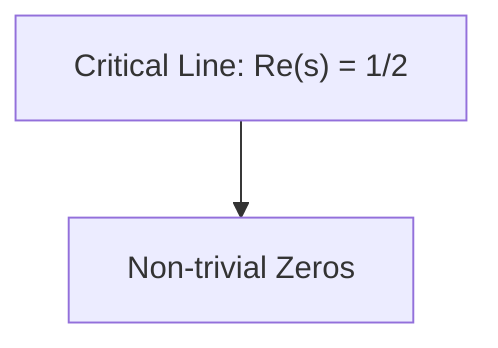

## Diagram Blocks

Use the Mermaid diagramming language to render diagrams and flowcharts.
Useful for visualizing complex concepts, processes, code architecture, and more.
ALWAYS use quotes around the node names in Mermaid.
Use HTML UTF-8 codes for special characters (without `&`), such as `#43;` for the + symbol and `#45;` for the - symbol.

For example:

