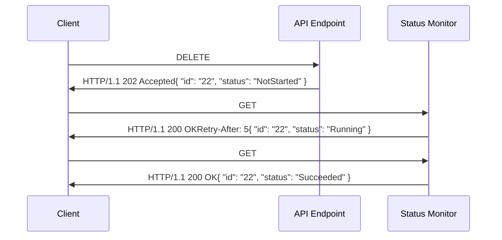
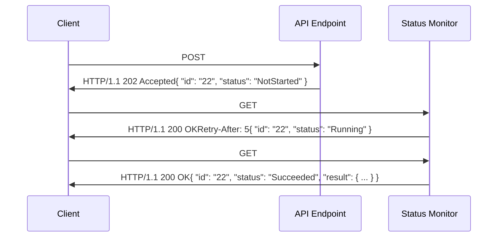

## Long-Running Operations

Long-running operations (LROs) are an API design pattern that should be used when the processing of
an operation may take a significant amount of time -- longer than a client will want to block
waiting for the result.

The request that initiates a long-running operation returns a response that points to or embeds
a _status monitor_, which is an ephemeral resource that will track the status and final result of the operation.
The status monitor resource is distinct from the target resource (if any) and specific to the individual
operation request.

There are four types of LROs allowed in Azure REST APIs:

1. An LRO to create or replace a resource that involves additional long-running processing.
2. An LRO to delete a resource.
3. An LRO to perform an action on or with an existing resource (or resource collection).
4. An LRO to perform an action not related to an existing resource (or resource collection).

The following sections describe these patterns in detail.

### Create or replace a resource requiring additional long-running processing
[](#put-with-additional-long-running-processing) 

A special case of long-running operations that occurs often is a PUT operation to create or replace a resource
that involves some additional long-running processing.
One example is a resource that requires physical resources (e.g. servers) to be "provisioned" to make the resource functional.

In this case:
- The operation must use the PUT method (NOTE: PATCH is never allowed here)
- The URL identifies the resource being created or replaced.
- The request and response body have identical schemas & represent the resource.
- The request may contain an `Operation-Id` header that the service will use as
the ID of the status monitor created for the operation.
- If the `Operation-Id` matches an existing operation and the request content is the same,
treat as a retry and return the same response as the earlier request.
Otherwise fail the request with a `409-Conflict`.

```text
PUT /items/FooBar&api-version=2022-05-01
Operation-Id: 22

{
   "prop1": 555,
   "prop2": "something"
}
```

In this case the response to the initial request is a `201 Created` to indicate that
the resource has been created or `200 OK` when the resource was replaced.
The response body should be a representation of the resource that was created,
and should include a `status` field indicating the current status of the resource.
A status monitor is created to track the additional processing and the ID of the status monitor
is returned in the `Operation-Id` header of the response.
The response must also include an `Operation-Location` header for backward compatibility.
If the resource supports ETags, the response may contain an `etag` header and possibly an `etag` property in the resource.

```text
HTTP/1.1 201 Created
Operation-Id: 22
Operation-Location: https://items/operations/22
etag: "123abc"

{
  "id": "FooBar",
  "status": "Provisioning",
  "prop1": 555,
  "prop2": "something",
  "etag": "123abc"
}
```

The client will issue a GET to the status monitor to obtain the status of the operation performing the additional processing.

```text
GET https://items/operations/22?api-version=2022-05-01
```

When the additional processing completes, the status monitor indicates if it succeeded or failed.

```text
HTTP/1.1 200 OK

{
   "id": "22",
   "status": "Succeeded"
}
```

If the additional processing failed, the service may delete the original resource if it is not usable in this state,
but should clearly document this behavior.

### Long-running delete operation

A long-running delete operation returns a `202 Accepted` with a status monitor which the client uses to determine the outcome of the delete.

The resource being deleted should remain visible (returned from a GET) until the delete operation completes successfully.

When the delete operation completes successfully, a client must be able to create a new resource with the same name without conflicts.

This diagram illustrates how a long-running DELETE operation is initiated and then how the client
determines it has completed and obtains its results:



1. The client sends the request to initiate the long-running DELETE operation.
The request may contain an `Operation-Id` header that the service uses as the ID of the status monitor created for the operation.

2. The service validates the request and initiates the operation processing.
If there are any problems with the request, the service responds with a `4xx` status code and error response body.
Otherwise the service responds with a `202-Accepted` HTTP status code.
The response body is the status monitor for the operation including the ID, either from the request header or generated by the service.
When returning a status monitor whose status is not in a terminal state, the response must also include a `retry-after` header indicating the minimum number of seconds the client should wait
before polling (GETing) the status monitor URL again for an update.
For backward compatibility, the response must also include an `Operation-Location` header containing the absolute URL
of the status monitor resource, including an api-version query parameter.

3. After waiting at least the amount of time specified by the previous response's `Retry-after` header,
the client issues a GET request to the status monitor using the ID in the body of the initial response.
The GET operation for the status monitor is documented in the REST API definition and the ID
is the last URL path segment.

4. The status monitor responds with information about the operation including its current status,
which should be represented as one of a fixed set of string values in a field named `status`.
If the operation is still being processed, the status field will contain a "non-terminal" value, like `NotStarted` or `Running`.

5. After the operation processing completes, a GET request to the status monitor returns the status monitor with a status field set to a terminal value -- `Succeeded`, `Failed`, or `Canceled` -- that indicates the result of the operation.
If the status is `Failed`, the status monitor resource contains an `error` field with a `code` and `message` that describes the failure.

6. There may be some cases where a long-running DELETE operation can be completed before the response to the initial request.
In these cases, the operation should still return a `202 Accepted` with the `status` property set to the appropriate terminal state.

7. The service is responsible for purging the status monitor resource.
It should auto-purge the status monitor resource after completion (at least 24 hours).
The service may offer DELETE of the status monitor resource due to GDPR/privacy.

### Long-running Action Operations

An action operation that is also long-running combines the [Action Operations](#action-operations) pattern
with the [Long Running Operations](#long-running-operations) pattern.

The operation is initiated with a POST operation and the operation path ends in `:<action>`.
A long-running POST should not be used for resource create: use PUT as described above.
PATCH must never be used for long-running operations: it should be reserved for simple resource updates.
If a long-running update is required it should be implemented with POST.

```text
POST /<service-or-resource-url>:<action>?api-version=2022-05-01
Operation-Id: 22

{
   "arg1": 123
   "arg2": "abc"
}
```

A long-running action operation returns a `202 Accepted` response with the status monitor in the response body.

```text
HTTP/1.1 202 Accepted
Operation-Location: https://<status-monitor-endpoint>/22

{
   "id": "22",
   "status": "NotStarted"
}
```

The client will issue a GET to the status monitor to obtain the status and result of the operation.

```text
GET https://<status-monitor-endpoint>/22?api-version=2022-05-01
```

When the operation completes successfully, the result (if there is one) will be included in the `result` field of the status monitor.

```text
HTTP/1.1 200 OK

{
   "id": "22",
   "status": "Succeeded",
   "result": { ... }
}
```

This diagram illustrates how a long-running action operation is initiated and then how the client
determines it has completed and obtains its results:



1. The client sends the request to initiate the long-running action operation.
The request may contain an `Operation-Id` header that the service uses as the ID of the status monitor created for the operation.

2. The service validates the request and initiates the operation processing.
If there are any problems with the request, the service responds with a `4xx` status code and error response body.
Otherwise the service responds with a `202-Accepted` HTTP status code.
The response body is the status monitor for the operation including the ID, either from the request header or generated by the service.
When returning a status monitor whose status is not in a terminal state, the response must also include a `retry-after` header indicating the minimum number of seconds the client should wait
before polling (GETing) the status monitor URL again for an update.
For backward compatibility, the response may also include an `Operation-Location` header containing the absolute URL
of the status monitor resource, including an api-version query parameter.

3. After waiting at least the amount of time specified by the previous response's `Retry-after` header,
the client issues a GET request to the status monitor using the ID in the body of the initial response.
The GET operation for the status monitor is documented in the REST API definition and the ID
is the last URL path segment.

4. The status monitor responds with information about the operation including its current status,
which should be represented as one of a fixed set of string values in a field named `status`.
If the operation is still being processed, the status field will contain a "non-terminal" value, like `NotStarted` or `Running`.

5. After the operation processing completes, a GET request to the status monitor returns the status monitor with a status field set to a terminal value -- `Succeeded`, `Failed`, or `Canceled` -- that indicates the result of the operation.
If the status is `Failed`, the status monitor resource contains an `error` field with a `code` and `message` that describes the failure.
If the status is `Succeeded`, the operation results (if any) are returned in the `result` field of the status monitor.

6. There may be some cases where a long-running action operation can be completed before the response to the initial request.
In these cases, the operation should still return a `202 Accepted` with the `status` property set to the appropriate terminal state.

7. The service is responsible for purging the status monitor resource.
It should auto-purge the status monitor resource after completion (at least 24 hours).
The service may offer DELETE of the status monitor resource due to GDPR/privacy.

### Long-running action operation not related to a resource

When a long-running action operation is not related to a specific resource (a batch operation is one example),
another approach is needed.

This type of LRO should be initiated with a PUT method on a URL that represents the operation to be performed,
and includes a final path parameter for the user-specified operation ID.
The response of the PUT includes a response body containing a representation of the status monitor for the operation
and an `Operation-Location` response header that contains the absolute URL of the status monitor.
In this type of LRO, the status monitor should include any information from the request used to initiate the operation,
so that a failed operation could be reissued if necessary.

Clients will use a GET on the status monitor URL to obtain the status and results of the operation.
Since the HTTP semantic for PUT is to create a resource, the same schema should be used for the PUT request body,
the PUT response body, and the response body of the GET for the status monitor for the operation.
For this type of LRO, the status monitor URL should be the same URL as the PUT operation.

The following examples illustrate this pattern.

```text
PUT /translate-operations/<operation-id>?api-version=2022-05-01

<JSON body with parameters for the operation>
```

Note that the client specifies the operation id in the URL path.

A successful response to the PUT operation should have a `201 Created` status and response body
that contains a representation of the status monitor _and_ any information from the request used to initiate the operation.

The service is responsible for purging the status monitor after some period of time,
but no earlier than 24 hours after the completion of the operation.
The service may offer DELETE of the status monitor resource due to GDPR/privacy.

### Controlling a long-running operation

It might be necessary to support some control action on a long-running operation, such as cancel.
This is implemented as a POST on the status monitor endpoint with `:<action>` added.

```text
POST /<status-monitor-endpoint>:cancel?api-version=2022-05-01
```

A successful response to a control operation should be a `200 OK` with a representation of the status monitor.

```text
HTTP/1.1 200 OK

{
   "id": "22",
   "status": "Canceled"
}
```