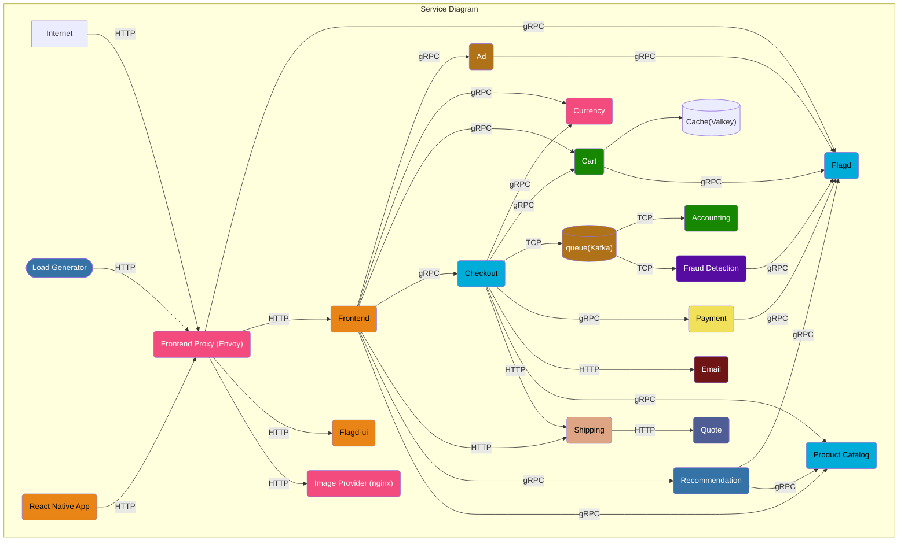
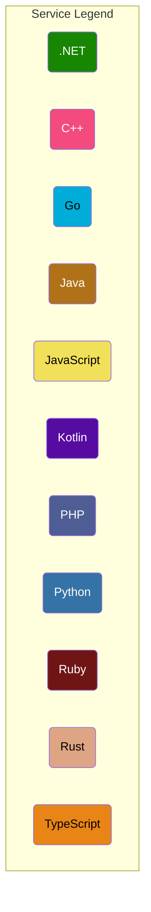
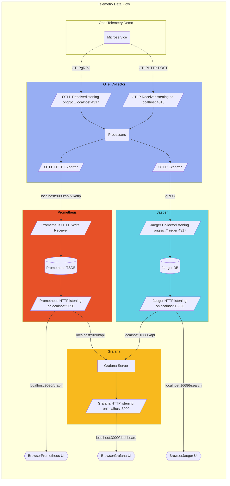

**OpenTelemetry ডেমো** বিভিন্ন প্রোগ্রামিং ভাষায় লেখা মাইক্রোসার্ভিস নিয়ে গঠিত, যা gRPC ও HTTP-এর মাধ্যমে একে অপরের সাথে যোগাযোগ করে। এছাড়াও এটি একটি লোড জেনারেটর যা [Locust](https://locust.io/) ব্যবহার করে নকল ইউজার ট্রাফিক তৈরি করে।

ডেমো অ্যাপ্লিকেশনগুলোর
[মেট্রিক](/docs/demo/telemetry-features/metric-coverage/) এবং
[ট্রেস](/docs/demo/telemetry-features/trace-coverage/) ইন্সট্রুমেন্টেশনের বর্তমান অবস্থা জানতে এই লিঙ্কগুলো অনুসরণ করুন।

কলেক্টরের কনফিগারেশন পাওয়া যাবে
[otelcol-config.yml](https://github.com/open-telemetry/opentelemetry-demo/blob/main/src/otel-collector/otelcol-config.yml)
ফাইলে, এখানে বিকল্প এক্সপোর্টারও কনফিগার করা যায়।

**Protocol Buffer Definitions গুলো** `/pb/` ডিরেক্টরিতে পাবেন।
